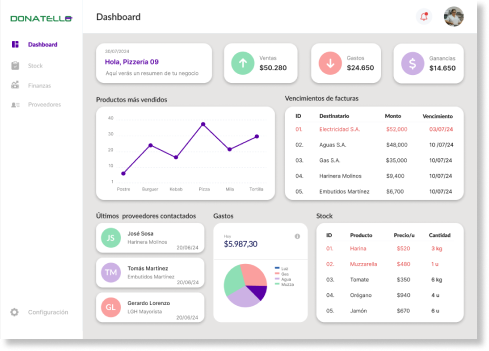

Aplicación web desarrollada en **Angular 16** que funciona como un **panel de control financiero** para pequeños comercios de comida. Permite gestionar inventario, proveedores y gastos, además de mostrar estadísticas visuales mediante **gráficos interactivos con Chart.js**.  



## 📑 Tabla de Contenidos
- [Características](#-características)  
- [Tecnologías utilizadas](#-tecnologías-utilizadas)  
- [Instalación](#-instalación)  
- [Ejecución del proyecto](#-ejecución-del-proyecto)  
- [Scripts disponibles](#-scripts-disponibles)  
- [Estructura del proyecto](#-estructura-del-proyecto)  
- [Configuración](#-configuración)  
- [Ejemplos de uso](#-ejemplos-de-uso)  
- [Posibles problemas y soluciones](#-posibles-problemas-y-soluciones)  

---

## ✨ Características
- 📦 **Gestión de stock**: Agregar, editar y eliminar productos disponibles en el inventario.  
- 🏪 **Gestión de proveedores**: Registrar y administrar proveedores.  
- 💰 **Cálculo de gastos**: Control de costos e ingresos.  
- 📈 **Gráficos dinámicos**: Visualización de métricas con **Chart.js**.  
- 🎨 **UI moderna**: Uso de **Angular Material**, **Bootstrap 5**, **TailwindCSS** y **Bootstrap Icons**.  

---

## 🛠 Tecnologías utilizadas
- [Angular 16](https://angular.io/)  
- [Angular Material](https://material.angular.io/)  
- [Bootstrap 5](https://getbootstrap.com/)  
- [Bootstrap Icons](https://icons.getbootstrap.com/)  
- [TailwindCSS](https://tailwindcss.com/)  
- [Chart.js](https://www.chartjs.org/) (para gráficos)  
- [RxJS](https://rxjs.dev/)  

---

## ⚙️ Instalación
Clona el repositorio y entra en la carpeta del proyecto:

```bash
git clone https://github.com/tuusuario/tu-repo.git
cd tu-repo
```

Instala las dependencias:

```bash
npm install
```

---

## ▶️ Ejecución del proyecto
Para levantar el servidor de desarrollo:

```bash
npm start
```

El proyecto se abrirá en [http://localhost:4200](http://localhost:4200).  

---

## 📜 Scripts disponibles
- `npm start` → Inicia el servidor de desarrollo.  
- `npm run build` → Compila la aplicación para producción en la carpeta `dist/`.  
- `npm run watch` → Compilación en modo *watch* (ideal para desarrollo).  
- `npm test` → Ejecuta los tests con Karma + Jasmine.  

---

## 📂 Estructura del proyecto
```
src/
 ┣ app/                # Componentes, servicios y módulos principales
 ┣ assets/             # Recursos estáticos (imágenes, íconos, etc.)
 ┣ styles.scss         # Estilos globales
 ┣ index.html          # HTML principal
 ┗ main.ts             # Punto de entrada
```

---

## 🔧 Configuración
- **Estilos principales**:  
  - Bootstrap (`bootstrap.min.css`)  
  - Angular Material (`purple-green.css`)  
  - TailwindCSS (`tailwind.config.js`)  
  - SCSS (`src/styles.scss`)  

- **Scripts cargados**:  
  - Bootstrap Bundle (`bootstrap.bundle.min.js`)  

---

## 💡 Ejemplos de uso
- 📊 Ver gráficos de ingresos vs gastos.  
- 📦 Consultar inventario en tiempo real.  
- 🏪 Revisar lista de proveedores y costos asociados.  
- 💰 Calcular utilidades con base en compras y ventas.  

---

## 🛠 Posibles problemas y soluciones
- **Error de dependencias al instalar**: Ejecutar  
  ```bash
  rm -rf node_modules package-lock.json && npm install
  ```  

